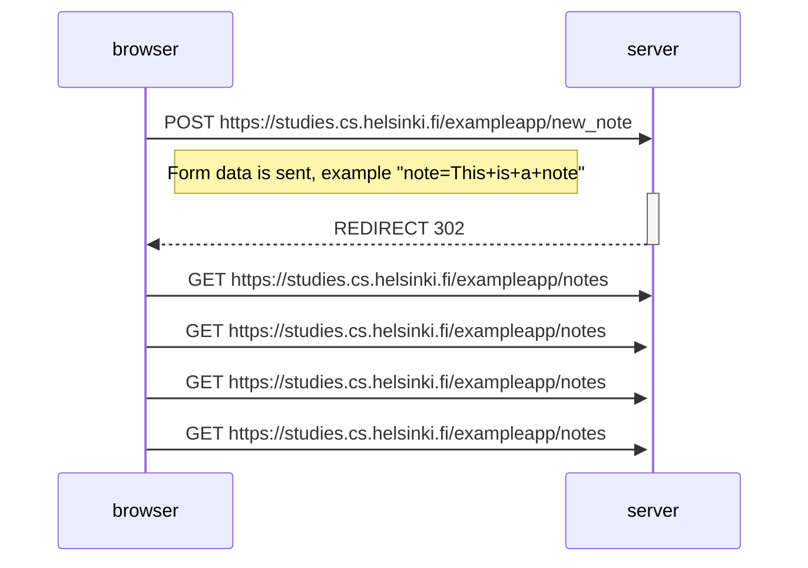

```mermaid
sequenceDiagram
    participant browser
    participant server    

    browser->>server: POST https://studies.cs.helsinki.fi/exampleapp/new_note
        Note right of browser: Form data is sent, example "note=This+is+a+note"
    activate server
    server-->>browser: REDIRECT 302 
    deactivate server   

    browser->>server: GET https://studies.cs.helsinki.fi/exampleapp/notes
    activate server   

     browser->>server: GET https://studies.cs.helsinki.fi/exampleapp/notes
    activate server  

     browser->>server: GET https://studies.cs.helsinki.fi/exampleapp/notes
    activate server  

     browser->>server: GET https://studies.cs.helsinki.fi/exampleapp/notes
    activate server   

```
