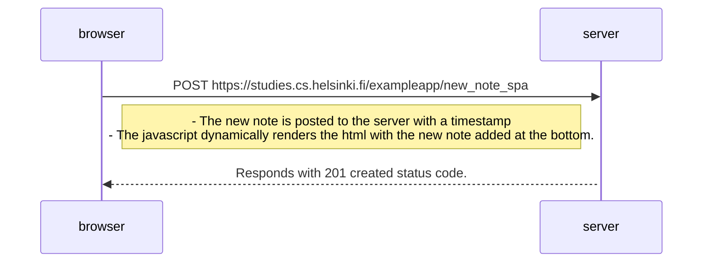

```mermaid
sequenceDiagram
    participant browser
    participant server    

    browser->>server: POST https://studies.cs.helsinki.fi/exampleapp/new_note_spa
    activate server

    Note right of browser: - The new note is posted to the server with a timestamp <br> - The javascript dynamically renders the html with the new note added at the bottom.

    server-->>browser: Responds with 201 created status code.

   
    
    
     
```
