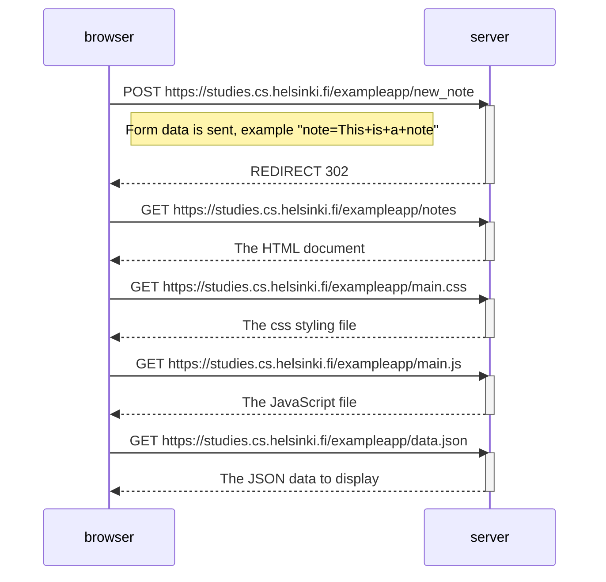

```mermaid
sequenceDiagram
    participant browser
    participant server    

    browser->>server: POST https://studies.cs.helsinki.fi/exampleapp/new_note
    activate server
        Note right of browser: Form data is sent, example "note=This+is+a+note"  
    server-->>browser: REDIRECT 302 
    deactivate server   

    browser->>server: GET https://studies.cs.helsinki.fi/exampleapp/notes
    activate server   
    server-->>browser: The HTML document
    deactivate server

     browser->>server: GET https://studies.cs.helsinki.fi/exampleapp/main.css
    activate server  
    server-->>browser: The css styling file
    deactivate server

     browser->>server: GET https://studies.cs.helsinki.fi/exampleapp/main.js
    activate server 
    server-->>browser: The JavaScript file 
    deactivate server

     browser->>server: GET https://studies.cs.helsinki.fi/exampleapp/data.json
    activate server  
    server-->>browser: The JSON data to display 
    deactivate server

```
