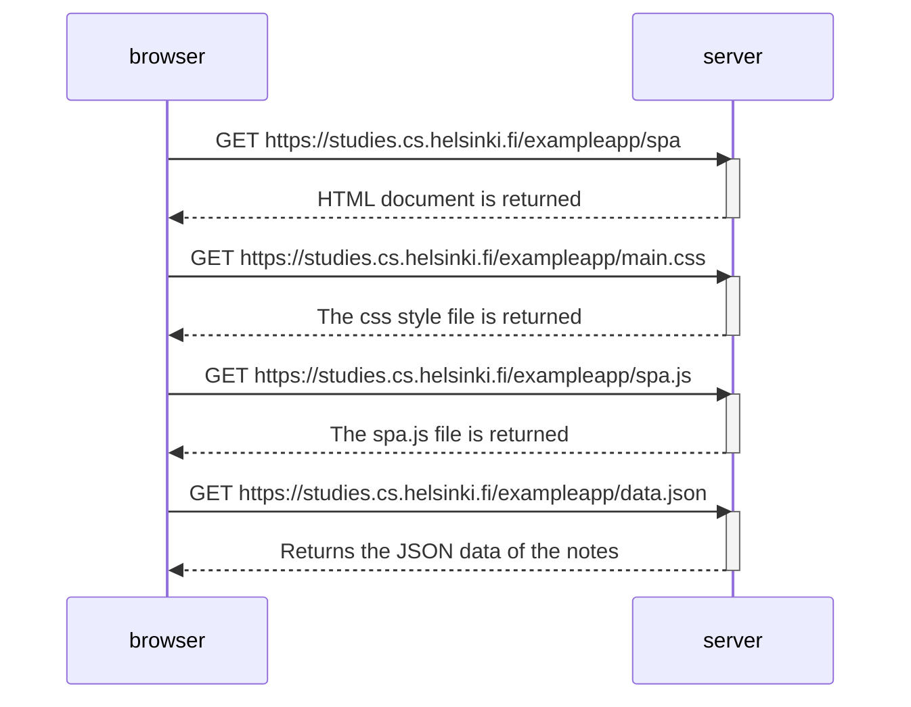

```mermaid
sequenceDiagram
    participant browser
    participant server    

    browser->>server: GET https://studies.cs.helsinki.fi/exampleapp/spa
    activate server      
    server-->>browser: HTML document is returned
    deactivate server 

    browser->>server: GET https://studies.cs.helsinki.fi/exampleapp/main.css
    activate server      
    server-->>browser: The css style file is returned
    deactivate server 

    browser->>server: GET https://studies.cs.helsinki.fi/exampleapp/spa.js
    activate server      
    server-->>browser: The spa.js file is returned
    deactivate server 

    browser->>server: GET https://studies.cs.helsinki.fi/exampleapp/data.json
    activate server      
    server-->>browser: Returns the JSON data of the notes
    deactivate server 

    
```
